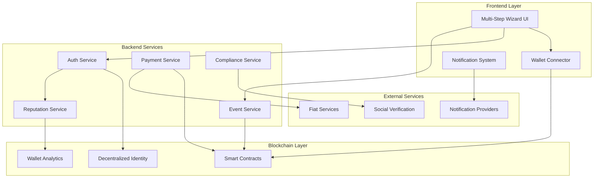
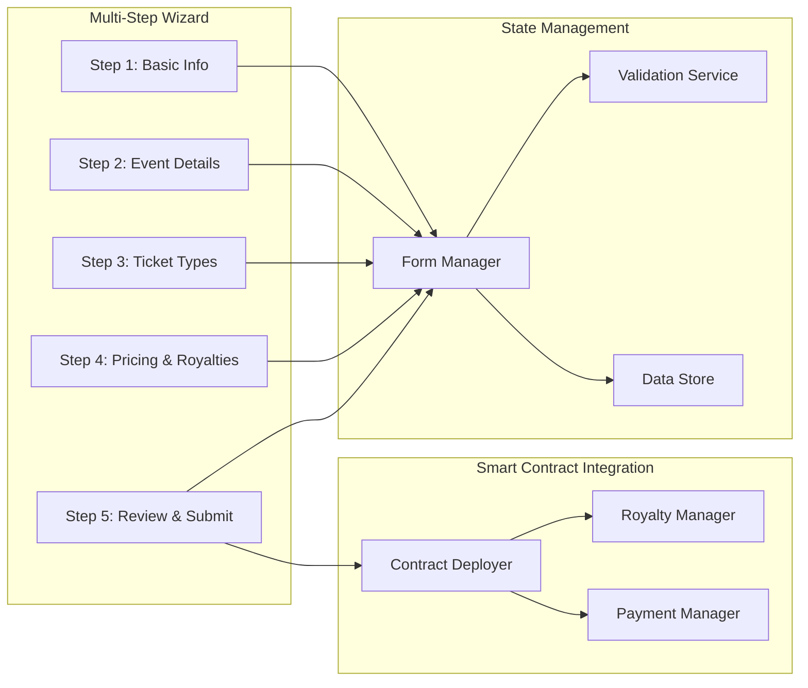

# Web3 Organizer Onboarding & Event Creation Design

## Overview

This design document outlines the technical architecture for a Web3-native event organizer onboarding system that eliminates traditional KYC barriers while maintaining compliance and trust. The system leverages blockchain technology, decentralized identity, smart contracts, and a progressive multi-step UI to create a seamless organizer experience with built-in royalty mechanisms.

## Architecture

### High-Level Architecture



### Component Architecture



## Components and Interfaces

### 1. Wallet-Based Authentication Service

```typescript
interface WalletAuthService {
  verifyWallet(address: string): Promise<WalletVerification>
  generateDID(walletData: WalletData): Promise<DecentralizedIdentity>
  calculateReputation(walletHistory: TransactionHistory): Promise<ReputationScore>
  createOrganizerProfile(wallet: string, did: string): Promise<OrganizerProfile>
}

interface WalletVerification {
  isValid: boolean
  walletAge: number
  transactionCount: number
  riskScore: number
  requiresAdditionalVerification: boolean
}

interface ReputationScore {
  score: number // 0-100
  factors: {
    walletAge: number
    transactionVolume: number
    defiParticipation: number
    communityVouches: number
  }
  trustLevel: 'LOW' | 'MEDIUM' | 'HIGH' | 'VERIFIED'
}
```

### 2. Multi-Step Event Creation Wizard

```typescript
interface EventCreationWizard {
  steps: WizardStep[]
  currentStep: number
  formData: EventFormData
  validation: ValidationState
  
  nextStep(): Promise<boolean>
  previousStep(): void
  validateCurrentStep(): ValidationResult
  saveProgress(): void
  submitEvent(): Promise<EventSubmissionResult>
}

interface WizardStep {
  id: string
  title: string
  component: React.ComponentType
  validation: ValidationRules
  isComplete: boolean
  isAccessible: boolean
}

interface EventFormData {
  basicInfo: {
    name: string
    category: string
    organizerName: string
    shortDescription?: string
  }
  eventDetails: {
    description: string
    venue: VenueInfo
    dateTime: DateTime
    duration: number
    bannerImage?: string
  }
  ticketTypes: TicketType[]
  pricingRoyalties: {
    royaltyPercentage: number
    revenueProjection: number
    gasEstimate: number
  }
}
```

### 3. Smart Contract Integration

```typescript
interface EventSmartContract {
  deployEventContract(eventData: EventFormData): Promise<ContractDeployment>
  setRoyaltyPercentage(contractAddress: string, percentage: number): Promise<Transaction>
  handleTicketResale(ticketId: string, newPrice: number): Promise<RoyaltyDistribution>
  withdrawEarnings(organizerAddress: string): Promise<WithdrawalResult>
}

interface RoyaltyDistribution {
  totalSale: number
  organizerRoyalty: number
  platformFee: number
  sellerAmount: number
  transactionHash: string
}
```

### 4. Web3-Native Compliance System

```typescript
interface Web3ComplianceService {
  // Decentralized Identity & Reputation
  analyzeWalletReputation(walletAddress: string): Promise<ReputationAnalysis>
  verifySocialProof(organizer: string, platforms: SocialPlatform[]): Promise<SocialVerification[]>
  calculateDecentralizedTrust(organizer: OrganizerProfile): Promise<TrustScore>
  
  // Smart Contract Compliance
  deployComplianceContract(organizer: string, jurisdiction: string): Promise<ComplianceContract>
  calculateTaxObligations(revenue: number, jurisdiction: string): Promise<TaxCalculation>
  generateBlockchainAuditTrail(organizer: string, period: DateRange): Promise<AuditTrail>
  
  // Progressive Compliance
  checkComplianceLevel(organizer: OrganizerProfile, eventRevenue: number): ComplianceLevel
  offerTraditionalUpgrade(organizer: string): Promise<KYCUpgradeOptions>
}

interface ReputationAnalysis {
  walletAge: number
  transactionVolume: number
  defiParticipation: number
  nftActivity: number
  communityVouches: CommunityVouch[]
  riskScore: number
  trustLevel: 'EMERGING' | 'ESTABLISHED' | 'VERIFIED' | 'PREMIUM'
}

interface ComplianceLevel {
  mode: 'WEB3_NATIVE' | 'HYBRID' | 'TRADITIONAL_KYC'
  revenueLimit: number
  requiredVerifications: Web3VerificationType[]
  features: ComplianceFeature[]
  taxHandling: 'AUTOMATED' | 'ASSISTED' | 'MANUAL'
}

interface Web3VerificationType {
  type: 'WALLET_HISTORY' | 'SOCIAL_PROOF' | 'COMMUNITY_VOUCH' | 'EVENT_HISTORY'
  status: 'PENDING' | 'VERIFIED' | 'FAILED'
  score: number
  expiresAt?: Date
}

interface TaxCalculation {
  jurisdiction: string
  taxRate: number
  reserveAmount: number
  paymentSchedule: PaymentSchedule[]
  complianceMethod: 'SMART_CONTRACT' | 'TRADITIONAL' | 'HYBRID'
}
```

## Data Models

### Organizer Profile

```typescript
interface OrganizerProfile {
  id: string
  walletAddress: string
  decentralizedIdentity: string
  
  // Web3 Reputation System
  reputation: DecentralizedReputation
  trustScore: TrustScore
  communityVouches: CommunityVouch[]
  socialVerifications: SocialVerification[]
  
  // Event Management
  events: EventSummary[]
  totalRevenue: number
  totalRoyalties: number
  successfulEvents: number
  
  // Web3-Native Compliance
  complianceMode: 'WEB3_NATIVE' | 'HYBRID' | 'TRADITIONAL_KYC'
  revenueThreshold: RevenueThreshold
  taxHandling: TaxHandlingPreference
  jurisdictions: string[]
  
  // Optional Traditional Integration
  traditionalKYC?: TraditionalKYCData
  bankIntegration?: BankIntegration
  
  // Timestamps
  createdAt: Date
  lastActive: Date
  verifiedAt?: Date
}

interface DecentralizedReputation {
  score: number // 0-1000
  level: 'EMERGING' | 'ESTABLISHED' | 'VERIFIED' | 'PREMIUM'
  factors: {
    walletAge: number
    transactionVolume: number
    eventSuccess: number
    communityEndorsements: number
    socialProof: number
  }
  badges: ReputationBadge[]
}

interface CommunityVouch {
  voucherAddress: string
  voucherReputation: number
  vouchType: 'PROFESSIONAL' | 'PERSONAL' | 'EVENT_COLLABORATION'
  message: string
  timestamp: Date
  weight: number
}

interface RevenueThreshold {
  current: number
  limit: number
  nextThreshold: number
  upgradeRequired: boolean
  upgradeOptions: ComplianceUpgradeOption[]
}

interface TaxHandlingPreference {
  method: 'AUTOMATED_SMART_CONTRACT' | 'ASSISTED_TOOLS' | 'MANUAL_EXPORT'
  jurisdiction: string
  reservePercentage: number
  paymentSchedule: 'REAL_TIME' | 'MONTHLY' | 'QUARTERLY' | 'ANNUAL'
}

interface SocialVerification {
  platform: 'TWITTER' | 'LINKEDIN' | 'GITHUB' | 'DISCORD'
  username: string
  verified: boolean
  verifiedAt: Date
  followerCount?: number
  accountAge?: number
}
```

### Event Data Model

```typescript
interface Event {
  id: string
  organizerId: string
  contractAddress: string
  
  // Basic Information
  name: string
  description: string
  category: EventCategory
  
  // Event Details
  venue: VenueInfo
  startDate: Date
  endDate: Date
  bannerImage: string
  
  // Ticketing
  ticketTypes: TicketType[]
  totalCapacity: number
  soldTickets: number
  
  // Financial
  royaltyPercentage: number
  totalRevenue: number
  organizerEarnings: number
  
  // Status
  status: 'DRAFT' | 'PENDING_APPROVAL' | 'APPROVED' | 'LIVE' | 'ENDED'
  approvalStatus: ApprovalStatus
  
  // Analytics
  analytics: EventAnalytics
}

interface TicketType {
  id: string
  name: string
  description: string
  price: number
  totalSupply: number
  availableSupply: number
  maxPerWallet: number
  saleStartDate?: Date
  saleEndDate?: Date
  benefits: string[]
}
```

### Smart Contract Models

```solidity
contract EventContract {
    struct TicketType {
        string name;
        uint256 price;
        uint256 totalSupply;
        uint256 availableSupply;
        uint256 maxPerWallet;
        bool isActive;
    }
    
    struct RoyaltyInfo {
        address organizer;
        uint256 percentage; // Basis points (5% = 500)
        uint256 totalEarned;
    }
    
    mapping(uint256 => TicketType) public ticketTypes;
    mapping(address => uint256) public purchasedTickets;
    RoyaltyInfo public royaltyInfo;
    
    event TicketPurchased(address buyer, uint256 ticketTypeId, uint256 quantity);
    event TicketResold(uint256 tokenId, address seller, address buyer, uint256 price);
    event RoyaltyPaid(address organizer, uint256 amount);
}
```

## Correctness Properties

*A property is a characteristic or behavior that should hold true across all valid executions of a system-essentially, a formal statement about what the system should do. Properties serve as the bridge between human-readable specifications and machine-verifiable correctness guarantees.*

### Property 1: Wallet Verification Consistency
*For any* wallet address, verifying the same wallet multiple times should produce consistent verification results
**Validates: Requirements 1.1, 1.3**

### Property 2: DID Generation Uniqueness
*For any* verified wallet, the system should generate a unique decentralized identity that maps one-to-one with the wallet address
**Validates: Requirements 1.2**

### Property 3: Reputation Score Determinism
*For any* wallet with identical transaction history, the reputation calculation should always produce the same score
**Validates: Requirements 1.3, 3.1**

### Property 4: Multi-Step Form Data Preservation
*For any* navigation between wizard steps, all previously entered form data should be preserved without loss
**Validates: Requirements 2.7, 8.5**

### Property 5: Step Validation Consistency
*For any* wizard step with validation rules, the same input data should always produce the same validation result
**Validates: Requirements 2.2, 8.6**

### Property 6: Smart Contract Deployment Integrity
*For any* completed event form, the deployed smart contract should contain all the specified event parameters
**Validates: Requirements 2.8**

### Property 7: Royalty Payment Accuracy
*For any* ticket resale transaction, exactly 5% of the sale price should be transferred to the organizer's wallet
**Validates: Requirements 4.1**

### Property 8: Compliance Threshold Consistency
*For any* organizer with revenue above ₹50,000, the system should consistently request optional tax information
**Validates: Requirements 3.3**

### Property 9: Real-time Update Latency
*For any* ticket sale, the live sales graph should update within 30 seconds of the transaction
**Validates: Requirements 5.1**

### Property 10: Withdrawal Processing Time
*For any* withdrawal request, the payment should be processed within 5 minutes
**Validates: Requirements 6.3**

### Property 11: Fee Transparency
*For any* transaction, the sum of organizer share, platform fees, and other deductions should equal the total transaction amount
**Validates: Requirements 6.2**

### Property 12: Progress Indicator Accuracy
*For any* wizard step navigation, the progress indicator should accurately reflect the current step and completion status
**Validates: Requirements 8.2**

### Property 13: Event Preview Completeness
*For any* completed wizard form, the preview should display all entered information without omission
**Validates: Requirements 8.7**

### Property 14: Reputation-Based Feature Unlocking
*For any* organizer reaching specific reputation thresholds, the corresponding features and limits should be unlocked automatically
**Validates: Requirements 7.2, 7.4**

### Property 15: Tax Report Accuracy
*For any* organizer's transaction history, the generated tax report should include all transactions and calculate totals correctly
**Validates: Requirements 6.5, 9.2**

## Error Handling

### Wallet Connection Errors
- **Network Issues**: Retry mechanism with exponential backoff
- **Wallet Rejection**: Clear user guidance and alternative options
- **Insufficient Funds**: Gas fee estimation and funding suggestions

### Form Validation Errors
- **Real-time Validation**: Immediate feedback on field completion
- **Cross-field Validation**: Validate relationships between fields
- **Progressive Enhancement**: Graceful degradation for JavaScript failures

### Smart Contract Errors
- **Gas Estimation Failures**: Provide manual gas setting options
- **Contract Deployment Failures**: Retry mechanism and error reporting
- **Transaction Failures**: Clear error messages and retry options

### Compliance Errors
- **Verification Failures**: Alternative verification methods
- **Threshold Violations**: Clear guidance on compliance requirements
- **Regulatory Changes**: Automatic adaptation and user notification

## Testing Strategy

### Unit Testing
- **Component Testing**: Test each wizard step component in isolation
- **Service Testing**: Test wallet verification, reputation calculation, and compliance services
- **Smart Contract Testing**: Test contract deployment, royalty distribution, and withdrawal functions
- **Validation Testing**: Test form validation rules and error handling

### Property-Based Testing
- **Wallet Verification Properties**: Test verification consistency across different wallet states
- **Form Data Persistence Properties**: Test data preservation during navigation
- **Royalty Calculation Properties**: Test royalty accuracy across different sale scenarios
- **Compliance Threshold Properties**: Test threshold-based feature activation

### Integration Testing
- **End-to-End Wizard Flow**: Test complete event creation process
- **Blockchain Integration**: Test smart contract deployment and interaction
- **External Service Integration**: Test social verification and fiat conversion services
- **Real-time Updates**: Test notification delivery and dashboard updates

### Performance Testing
- **Load Testing**: Test system performance under high organizer registration load
- **Blockchain Performance**: Test gas optimization and transaction throughput
- **UI Responsiveness**: Test wizard performance with large form data
- **Real-time Update Performance**: Test notification delivery speed and accuracy

This design provides a comprehensive Web3-native solution that eliminates traditional KYC barriers while maintaining trust, compliance, and excellent user experience through progressive enhancement and smart contract automation.